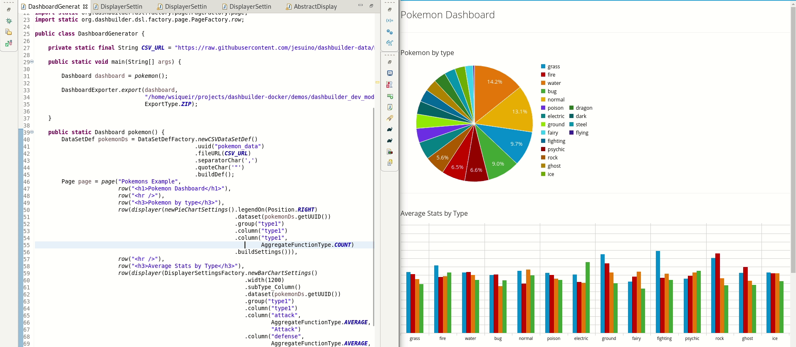

Dashbuilder Runtime in Dev Mode
--

This is a Dashbuilder Runtime setup to run in dev mode. Models placed in `models` dir will be auto reloaded and the results will be immediatelly visible

A good usage is using new Dashbuilder DSL as you can see in project `dashbuilder-dsl-dashboards`. You just need to configure it to output models in the models dir, so import the project in your IDE of choice and be happy creating dashboards!




### Running

To start run:
```
podman-compose up -d
```

Then access `http://localhost:8080` and login as `admin/admin`. Place models in `models` dir and you should see the UI updating accordingly.
