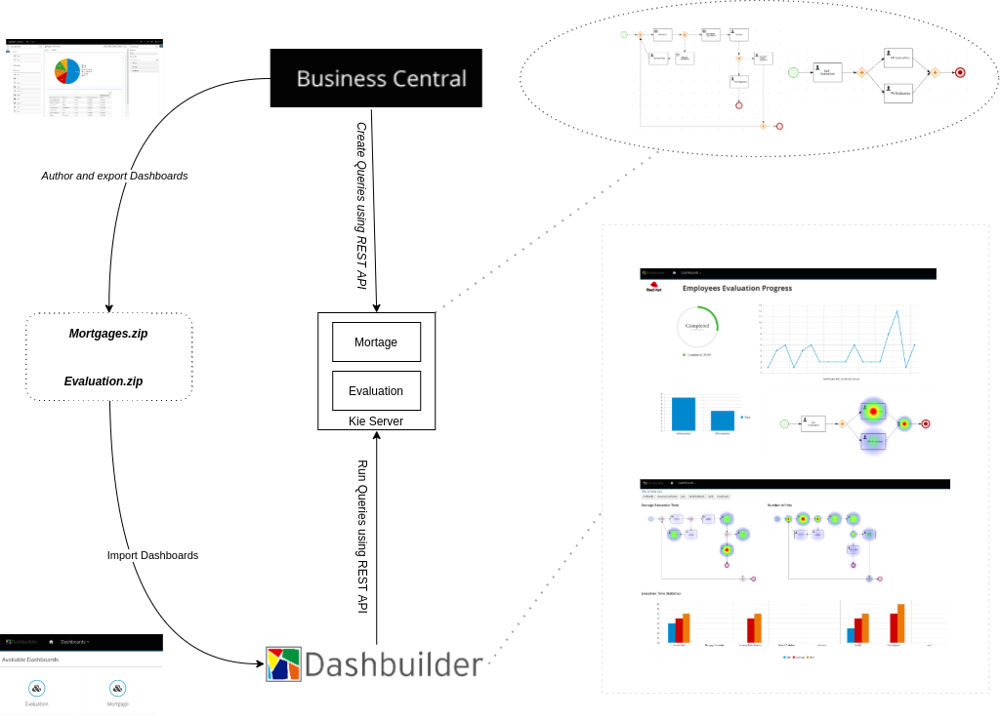

Evaluation Dashboard Demo
--

This demo starts all custom images to play with Kie Server and Dashbuilder.

### Demo

In this demo you will find (the ports to access each application:

* **Kie Server**: Kie Server instance with evaluation container already started. Kie Server, or Kie Execution Server, is an application to install kjars and run business process and rules. See more in: https://docs.jboss.org/drools/release/6.2.0.Final/drools-docs/html/ch19.html
* **Dashbuilder WebApp**: Web application to create and edit dashboards. This application is already setup to connect to the Kie Server mentioned above.
* **Dashbuilder Runtime**: An application that can run dashboards created and exported from Business Central or from Dashbuilder web app. It is also configured to access Kie Server

### Instructions

** *This requires at least 2g of free memory to run* ** 

In this directory run `podman-compose up -d` and it will start all the pieces for this demo. 

#### Accessing each server:

* Kie Server: `localhost:8080/kie-server/docs`  - user `kieserver:kieserver1!`
* Dashbuilder WebApp: `localhost:8180/dashbuilder-webapp` - user `admin/admin`
* Dashbuilder Runtime: `localhost:8280/` - user `admin/admin`

To see some action access Evaluation Dashboard, then "Evaluation Progress" page and run `demos/scripts/evaluation_demo/main.sh`. It will start and complete 7 evaluation that can be followed in real time.

