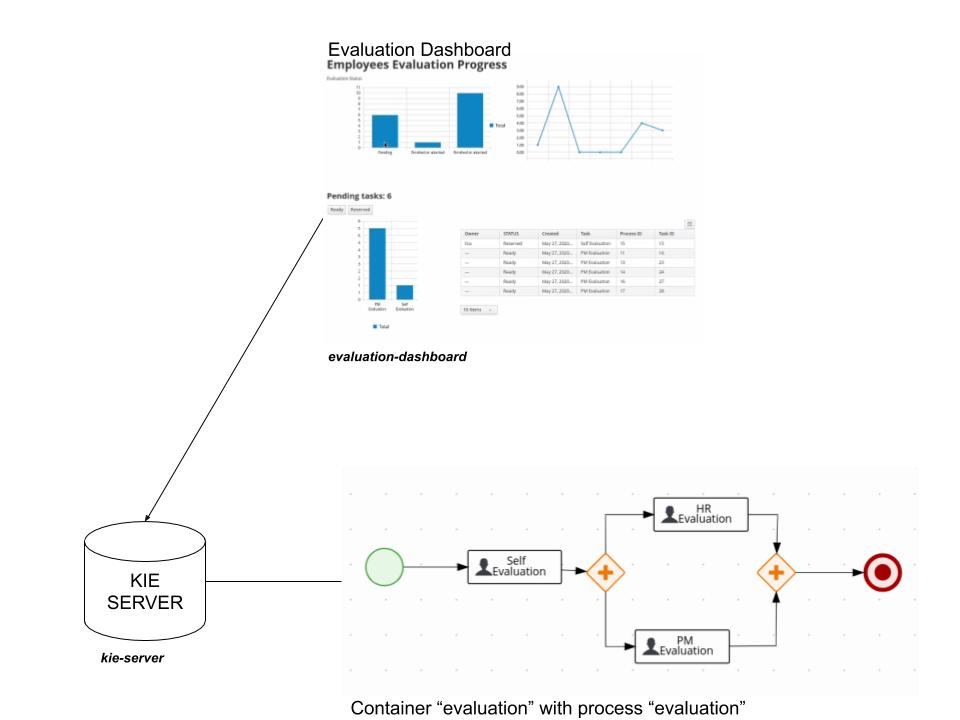

Evaluation Dashboard Compose
--

This demo starts a Kie Server and a sample dashboard

### Containers

In this demo you will find:

* **Kie Server**: Kie Server instance with evaluation container already started. Kie Server, or Kie Execution Server, is an application to install kjars and run business process and rules. See more in: https://docs.jboss.org/drools/release/6.2.0.Final/drools-docs/html/ch19.html
* **Evaluation Dashboard**: A dashbuilder Runtime installation configured to access Kie Server and with an Evaluation sample dashboard.

### Instructions

In this directory run `podman-compose up -d` and it will start all the pieces for this demo.

Accessing each server:

* Kie Server: `localhost:8080/kie-server/docs` - user `kieserver:kieserver1!`
* Evaluation Dashboard: `localhost:8180/` - user `admin/admin`

#### Generating Evaluations

Access Evaluation Dashboard, then "Evaluation Progress" page and run `demos/scripts/evaluation_demo/main.sh`. It will start and complete 7 evaluation that can be followed in real time.

See:

